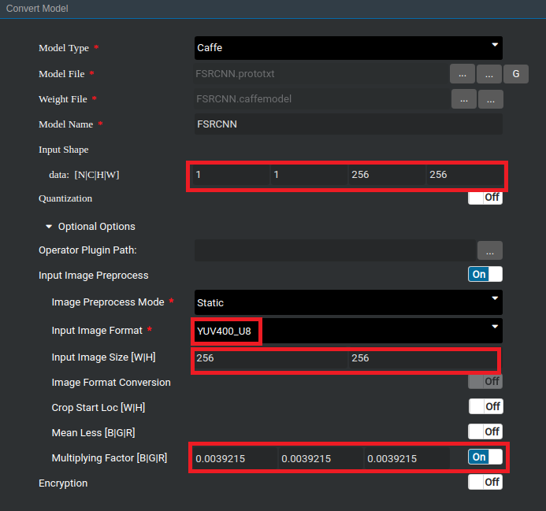

EN|[CN](README_cn.md)

# Super Resolution

The super-resolution application runs on the Atlas 200 DK or the AI acceleration cloud server and implements the inference function by using SRCNN, FSRCNN and ESPCN super-resolution networks.

## Prerequisites

Before using an open source application, ensure that:

-   Mind Studio  has been installed.
-   The Atlas 200 DK developer board has been connected to  Mind Studio, the cross compiler has been installed, the SD card has been prepared, and basic information has been configured.

## Software Preparation

Before running the application, obtain the source code package and configure the environment as follows.

1.  Obtain the source code package.

    Download all the code in the sample-superresolution repository at  [https://github.com/GreyZzzzzzXh/sample-superresolution](https://github.com/GreyZzzzzzXh/sample-superresolution)  to any directory on Ubuntu Server where  Mind Studio  is located as the  Mind Studio  installation user, for example,  _/home/ascend/sample-superresolution_.

2.  Obtain the source network model required by the application.

    The three original network model weights used in this application are trained by the open source code [SRCNN](http://mmlab.ie.cuhk.edu.hk/projects/SRCNN.html), [FSRCNN](http://mmlab.ie.cuhk.edu.hk/projects/FSRCNN.html) and [ESPCN](https://github.com/wangxuewen99/Super-Resolution/tree/master/ESPCN). In addition, in the network model file, some modifications need to be made to the padding parameter to ensure that the size of the feature map after convolution remains unchanged.

    The modified network model file that can be applied to the inference and the weight file obtained after training have been stored in _sample-superresolution/caffemodel_.

3.  Convert the source network model to a Da Vinci model.
    1.  Choose  **Tool \> Convert Model**  from the main menu of  Mind Studio. The  **Convert Model**  page is displayed.

    2.  On the  **Convert Model**  page, set  **Model File** and  **Weight File**  to the model file and weight file respectively.
        -   Set the corresponding **Input Shape** based on the height and width of the low resolution image. If you choose an **SRCNN** network, the width and height here need to be set to **3** times the low resolution image. Also, note that both **N** and **C** must to be set to **1**.
        
        -   In **Input Image Preprocess**, select **Input Image Format** as **YUV400_U8**, **Input Image Size** is the same width and height as **Input Shape**, and **Multiplying Factor** is set to **0.0039215**.

            **Figure  1** Model conversion configuration reference  
            

    3.  Click  **OK**  to start model conversion.

        After successful conversion, a .om Da Vinci model is generated in the  **$HOME/tools/che/model-zoo/my-model/xxx**  directory.

4.  Log in to Ubuntu Server where  Mind Studio  is located as the  Mind Studio  installation user and set the environment variable  **DDK\_HOME**.

    **vim \~/.bashrc**

    Run the following commands to add the environment variables  **DDK\_HOME**  and  **LD\_LIBRARY\_PATH**  to the last line:

    **export DDK\_HOME=/home/XXX/tools/che/ddk/ddk**

    **export LD\_LIBRARY\_PATH=$DDK\_HOME/uihost/lib**

    > **NOTE:**   
    >-   **XXX**  indicates the  Mind Studio  installation user, and  **/home/XXX/tools**  indicates the default installation path of the DDK.  
    >-   If the environment variables have been added, skip this step.  

    Enter  **:wq!**  to save and exit.

    Run the following command for the environment variable to take effect:

    **source \~/.bashrc**

## Deployment

1.  Access the root directory where the super-resolution application code is located as the  Mind Studio  installation user, for example,  _**/home/ascend/sample-superresolution**_.

2.  Run the deployment script to prepare the project environment, including compiling and deploying the application.

    **bash deploy.sh  _host\_ip_**

    -   _host\_ip_: For the Atlas 200 DK developer board, this parameter indicates the IP address of the developer board.For the AI acceleration cloud server, this parameter indicates the IP address of the host.

    Example command:

    **bash deploy.sh 192.168.1.2**

3.  Upload the generated Da Vinci offline model and images to be inferred to the directory of the  **HwHiAiUser**  user on the host.

    For example, upload the model file  **FSRCNN_256_256.om**  to the  **/home/HwHiAiUser/models**  directory on the host, and upload the image folder **Set5** to the **/home/HwHiAiUser/images** directory.

    The image requirements are as follows:

    -   Format: JPG, PNG, and BMP.
    -   Width of the input image: the value is an integer ranging from 16px to 4096px.
    -   Height of the input image: the value is an integer ranging from 16px to 4096px.

## Running

1.  Log in to the Host as the  **HwHiAiUser**  user in SSH mode on Ubuntu Server where  Mind Studio  is located.

    **ssh HwHiAiUser@**_host\_ip_

    For the Atlas 200 DK, the default value of  _**host\_ip**_  is  **192.168.1.2**  \(USB connection mode\) or  **192.168.0.2**  \(NIC connection mode\).

    For the AI acceleration cloud server,  _**host\_ip**_  indicates the IP address of the server where  Mind Studio  is located.

2.  Go to the path of the executable file of super-resolution application.

    **cd \~/HIAI\_PROJECTS/ascend\_workspace/classification/out**

3.  Run the application.

    Run the  **run\_classification.py**  script to generate a super-resolution image and save it to the current directory.

    Example command:

    **python3 run\_classification.py -t _0_ -m _\~/models/SRCNN\_768\_768.om_ -w _768_ -h _768_ -i _\~/images/Set5/butterfly\_GT.bmp_ -c _1_**

    **python3 run\_classification.py -t _1_ -m _\~/models/FSRCNN\_256\_256.om_ -w _256_ -h _256_ -i _\~/images/Set5/butterfly\_GT.bmp_ -c _1_**

    **python3 run\_classification.py -t _2_ -m _\~/models/ESPCN\_256\_256.om_ -w _256_ -h _256_ -i _\~/images/Set5/butterfly\_GT.bmp_ -c _1_**

    -   **-t/model\_type**: type of super-resolution network. The value is an integer ranging from 0 to 2, and 0, 1, and 2 represent SRCNN, FSRCNN, and ESPCN respectively.
    -   **-m/model\_path**: path for storing offline models
    -   **-w/model\_width**: width of the input image of a model. The value is an integer ranging from 16px to 4096px. 
    -   **-h/model\_height**: height of the input image of a model. The value is an integer ranging from 16px to 4096px. 
    -   **-i/input\_path**: path of the input image. It can be a directory, indicating that all images in the current directory are used as input (Multiple inputs can be specified).
    -   **-c/is\_colored**: whether to generate a color image. The value is an integer 0 or 1, and 0 indicates that a grayscale image is generated, and 1 indicates that a color image is generated.

    For other parameters, run the  **python3 run\_classification.py --help**  command. For details, see the help information.

4.  Copy the super-resolution image generated in the current directory back to the Ubuntu server where Mind Studio is located for viewing.

