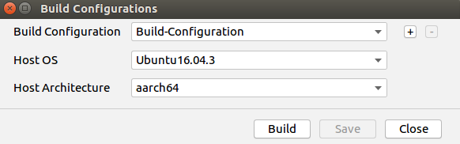

# 图像超分辨率网络应用（C++）<a name="ZH-CN_TOPIC_0208837235"></a>

本Application支持运行在Atlas 200 DK或者AI加速云服务器上，实现了对SRCNN、FSRCNN和ESPCN三种图像超分辨率网络的推理功能。

## 前提条件<a name="zh-cn_topic_0203223265_section137245294533"></a>

部署此Sample前，需要准备好以下环境：

-   已完成Mind Studio的安装。
-   已完成Atlas 200 DK开发者板与Mind Studio的连接，交叉编译器的安装，SD卡的制作及基本信息的配置等。

## 软件准备<a name="zh-cn_topic_0203223265_section181111827718"></a>

运行此Sample前，需要按照此章节获取源码包，并进行相关的环境配置。

1.  <a name="zh-cn_topic_0203223265_li953280133816"></a>获取源码包。

    将[https://github.com/GreyZzzzzzXh/sample-superresolution/tree/1.3x.0.0/](https://github.com/GreyZzzzzzXh/sample-superresolution/tree/1.3x.0.0/)仓中的代码以Mind Studio安装用户下载至Mind Studio所在Ubuntu服务器的任意目录。例如代码存放路径为：_$HOME/AscendProjects/sample-superresolution_。

2.  <a name="zh-cn_topic_0203223265_li29641938112018"></a>获取此应用中所需要的原始网络模型。

    此应用中使用的三个原始网络模型权重分别通过[SRCNN](http://mmlab.ie.cuhk.edu.hk/projects/SRCNN.html)、[FSRCNN](http://mmlab.ie.cuhk.edu.hk/projects/FSRCNN.html)以及[ESPCN](https://github.com/wangxuewen99/Super-Resolution/tree/master/ESPCN)开源代码训练得到。另外，在网络模型文件中，需要对padding参数做一些修改以保证卷积后特征图的尺寸不变。

    修改后可适用于推理的网络模型文件及训练后得到的权重文件，已存放至 _sample-superresolution/caffemodel_。

3.  以Mind Studio安装用户登录Mind Studio所在Ubuntu服务器，确定当前使用的DDK版本号并设置环境变量DDK\_HOME，tools\_version，NPU\_DEVICE\_LIB和LD\_LIBRARY\_PATH。
    1.  <a name="zh-cn_topic_0203223265_zh-cn_topic_0203223294_li61417158198"></a>查询当前使用的DDK版本号。

        可通过Mind Studio工具查询，也可以通过DDK软件包进行获取。

        -   使用Mind Studio工具查询。

            在Mind Studio工程界面依次选择“File \> Settings \> System Settings \> Ascend DDK“，弹出如[图 DDK版本号查询](zh-cn_topic_0203223294.md#fig94023140222)所示界面。

            **图 1**  DDK版本号查询<a name="zh-cn_topic_0203223265_zh-cn_topic_0203223294_fig17553193319118"></a>  
            

            其中显示的**DDK Version**就是当前使用的DDK版本号，如**1.31.T15.B150**。

        -   通过DDK软件包进行查询。

            通过安装的DDK的包名获取DDK的版本号。

            DDK包的包名格式为：**Ascend\_DDK-\{software version\}-\{interface version\}-x86\_64.ubuntu16.04.tar.gz**

            其中**software version**就是DDK的软件版本号。

            例如：

            DDK包的包名为Ascend\_DDK-1.31.T15.B150-1.1.1-x86\_64.ubuntu16.04.tar.gz，则此DDK的版本号为1.31.T15.B150。

    2.  设置环境变量。

        **vim \~/.bashrc**

        执行如下命令在最后一行添加DDK\_HOME及LD\_LIBRARY\_PATH的环境变量。

        **export tools\_version=_1.31.X.X_**

        **export DDK\_HOME=$HOME/.mindstudio/huawei/ddk/_1.31.X.X_/ddk**

        **export NPU\_DEVICE\_LIB=$DDK\_HOME/../RC/host-aarch64\_Ubuntu16.04.3/lib**

        **export LD\_LIBRARY\_PATH=$DDK\_HOME/lib/x86\_64-linux-gcc5.4**

        > **说明：**   
        >-   **_1.31.X.X_**是[1](#zh-cn_topic_0203223265_zh-cn_topic_0203223294_li61417158198)中查询到的DDK版本号，需要根据查询结果对应填写，如**1.31.T15.B150**  
        >-   如果此环境变量已经添加，则此步骤可跳过。  

        输入**:wq!**保存退出。

        执行如下命令使环境变量生效。

        **source \~/.bashrc**

4.  将原始网络模型转换为适配昇腾AI处理器的模型。

    1.  在Mind Studio操作界面的顶部菜单栏中选择**Tool \> Convert Model**，进入模型转换界面。

        

    2.  在弹出的**Convert Model**操作界面中，进行模型转换配置。
        -   Model File选择 _sample-superresolution/caffemodel_ 中提供的模型文件（SRCNN、FSRCNN或ESPCN），此时会自动匹配到权重文件并填写在Weight File中。
        -   Model Name填写为对应的**模型名称**。

            

        -   根据低分辨率图像的高度和宽度，设置对应的 Input Node。如果选择的是SRCNN网络，此处的宽高需要设置为低分辨率图像的三倍。另外，注意其中的**N**和**C**都需要设置为1。

            **图 2**  Nodes配置示例<a name="zh-cn_topic_0203223265_fig95695336322"></a>  
            

        -   AIPP配置中，选择**Input Image Format**为YUV400_U8，**Input Image Size**与**Input Node**中的宽高相同，**Multiplying Factor**设置为 0.0039215。

            **图 3**  AIPP配置示例<a name="zh-cn_topic_0203223265_fig14632122193310"></a>  
            

    3.  单击OK开始转换模型。

        模型转换成功后，后缀为.om的离线模型存放地址为 _$HOME/modelzoo/XXX/device_ 。

    > **说明：**   
    >-   Mindstudio模型转换中每一步的具体意义和参数说明可以参考[https://ascend.huawei.com/doc/mindstudio/2.1.0\(beta\)/zh/zh-cn\_topic\_0188462651.html](https://ascend.huawei.com/doc/mindstudio/2.1.0(beta)/zh/zh-cn_topic_0188462651.html)  
    >-   XXX表示当前转换的模型名称，如FSRCNN.om存放地址为$HOME/modelzoo/FSRCNN/device。  

5.  <a name="zh-cn_topic_0203223265_li470213205618"></a>将转换好的模型文件（.om文件）上传到[步骤1](#zh-cn_topic_0203223265_li953280133816)中源码所在路径下的“**sample-superresolution/script**”目录下。

## 编译<a name="zh-cn_topic_0203223265_section18931344873"></a>

1.  打开对应的工程。

    以Mind Studio安装用户在命令行进入安装包解压后的“MindStudio-ubuntu/bin”目录，如$HOME/MindStudio-ubuntu/bin。执行如下命令启动Mind Studio。

    **./MindStudio.sh**

    启动成功后，打开**sample-superresolution**工程，如[图 打开superresolution工程](#zh-cn_topic_0203223265_fig11106241192810)所示。

    **图 4**  打开superresolution工程<a name="zh-cn_topic_0203223265_fig11106241192810"></a>  
    

2.  在**src/param\_configure.conf**文件中配置相关工程信息。

    **图 5**  配置文件路径<a name="zh-cn_topic_0203223265_fig0391184062214"></a>  
    

    该配置文件内容如下：

    ```
    remote_host=
    model_name=
    ```

    需要手动添加参数配置：

    -   remote\_host：Atlas 200 DK开发者板的IP地址。
    -   model\_name : 离线模型名称。

    配置示例：

    ```
    remote_host=192.168.1.2
    model_name=FSRCNN_256_256.om
    ```

    > **说明：**   
    >-   参数必须全部填写，否则无法通过build。  
    >-   注意参数填写时不需要使用“”符号。  
    >-   配置文件中只能填入单个模型名称，填入的模型必须为[步骤5](#zh-cn_topic_0203223265_li470213205618)中存储的模型之一。本示例是以FSRCNN举例，用户可以使用本样例列举的其它模型按照文档步骤进行替换运行。  

3.  开始编译，打开Mind Studio工具，在工具栏中点击**Build \> Build \> Build-Configuration**。如[图 编译操作及生成文件](#zh-cn_topic_0203223265_fig1741464713019)所示，会在目录下生成build和run文件夹。

    **图 6**  编译操作及生成文件<a name="zh-cn_topic_0203223265_fig1741464713019"></a>  
    

    > **说明：**   
    >首次编译工程时，**Build \> Build**为灰色不可点击状态。需要点击**Build \> Edit Build Configuration**，配置编译参数后再进行编译。  
    >  

4.  将需要推理的图片上传至Host侧任一属组为HwHiAiUser用户的目录。

    图片要求如下：

    -   格式：jpg、png、bmp。
    -   输入图片宽度：16px\~4096px之间的整数。
    -   输入图片高度：16px\~4096px之间的整数。


## 运行<a name="zh-cn_topic_0203223265_section372782554919"></a>

1.  在Mind Studio工具的工具栏中找到Run按钮，单击  **Run \> Run 'sample-superresolution'**，如[图 程序已执行示意图](#zh-cn_topic_0203223265_fig93931954162719)所示，可执行程序已经在开发者板执行。

    **图 7**  程序已执行示意图<a name="zh-cn_topic_0203223265_fig93931954162719"></a>  
    

    以上报错信息请忽略，因为Mind Studio无法为可执行程序传参，上述步骤是将可执行程序与依赖的库文件部署到开发者板，此步骤需要ssh登录到开发者板至相应的目录文件下手动执行，具体请参考以下步骤。

2.  在Mind Studio所在Ubuntu服务器中，以HwHiAiUser用户SSH登录到Host侧。

    **ssh HwHiAiUser@**_host\_ip_

    对于Atlas 200 DK，host\_ip默认为192.168.1.2（USB连接）或者192.168.0.2（NIC连接）。

3.  进入图像超分辨率网络应用的可执行文件所在路径。

    **cd \~/HIAI\_PROJECTS/workspace\_mind\_studio/sample-superresolution/out**

4.  执行应用程序。

    执行**run\_superresolution.py**脚本会生成超分辨率图片，并保存至当前目录。

    命令示例如下所示：

    **python3 run\_superresolution.py -t _0_ -w _768_ -h _768_ -i _\~/images/Set5/butterfly\_GT.bmp_ -c _1_**

    **python3 run\_superresolution.py -t _1_ -w _256_ -h _256_ -i _\~/images/Set5/butterfly\_GT.bmp_ -c _1_**

    **python3 run\_superresolution.py -t _2_ -w _256_ -h _256_ -i _\~/images/Set5/butterfly\_GT.bmp_ -c _1_**

    -   -t/model\_type：超分辨率网络类型，为0~2之间的整数，0、1、2分别代表SRCNN、FSRCNN与ESPCN。
    -   -w/model\_width：模型的输入图片宽度，为16\~4096之间的整数。
    -   -h/model\_height：模型的输入图片高度，为16\~4096之间的整数。
    -   -i/input\_path：输入图片的路径，可以是目录，表示当前目录下的所有图片都作为输入（可以指定多个输入）。
    -   -c/is\_colored：是否生成彩色图像，为整数0或者1，0表示生成灰度图像，1表示生成彩色图像。

    其他详细参数请执行**python3 run\_superresolution.py --help**命令参见帮助信息。

5.  将当前目录下生成的超分辨率图像拷贝回Mind Studio所在Ubuntu服务器进行查看。
