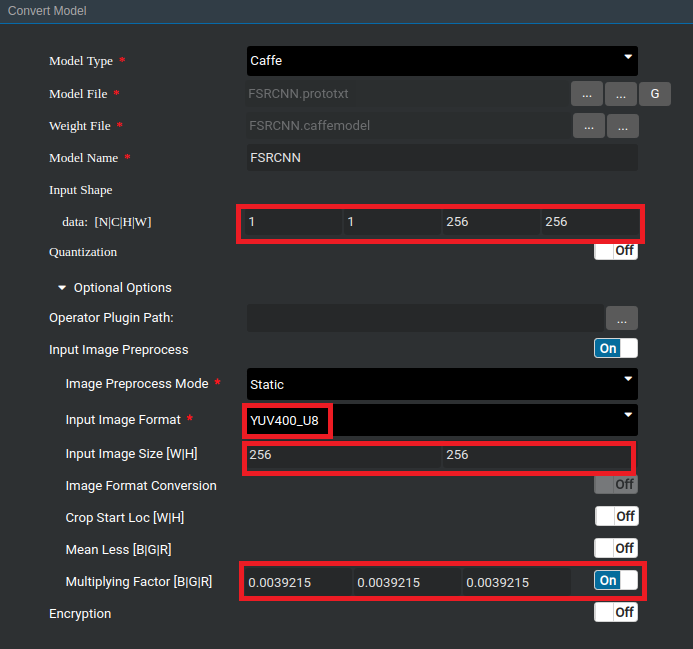

中文|[英文](README.md)

# 图像超分辨率网络应用

本Application支持运行在Atlas 200 DK或者AI加速云服务器上，实现了对SRCNN、FSRCNN和ESPCN三种图像超分辨率网络的推理功能。

## 前提条件

部署此Sample前，需要准备好以下环境：

-   已完成Mind Studio的安装。
-   已完成Atlas 200 DK开发者板与Mind Studio的连接，交叉编译器的安装，SD卡的制作及基本信息的配置等。

## 软件准备

运行此Sample前，需要按照此章节获取源码包，并进行相关的环境配置。

1.  获取源码包。

    将[https://github.com/GreyZzzzzzXh/sample-superresolution](https://github.com/GreyZzzzzzXh/sample-superresolution)仓中的代码以Mind Studio安装用户下载至Mind Studio所在Ubuntu服务器的任意目录，例如代码存放路径为：_/home/ascend/sample-superresolution_。

2.  获取此应用中所需要的原始网络模型。

    此应用中使用的三个原始网络模型权重分别通过[SRCNN](http://mmlab.ie.cuhk.edu.hk/projects/SRCNN.html)、[FSRCNN](http://mmlab.ie.cuhk.edu.hk/projects/FSRCNN.html)以及[ESPCN](https://github.com/wangxuewen99/Super-Resolution/tree/master/ESPCN)开源代码训练得到。另外，在网络模型文件中，需要对padding参数做一些修改以保证卷积后特征图的尺寸不变。

    修改后可适用于推理的网络模型文件及训练后得到的权重文件，已存放至 _sample-superresolution/caffemodel_。

3.  将原始网络模型转换为Davinci模型。
    1.  在Mind Studio操作界面的顶部菜单栏中选择**Tool \> Convert Model**，进入模型转换界面。

    2.  在弹出的**Convert Model**操作界面中，**Model File**与**Weight File**分别选择模型文件和权重文件。
        -   根据低分辨率图像的高度和宽度，设置对应的**Input Shape**。如果选择的是SRCNN网络，此处的宽高需要设置为低分辨率图像的三倍。另外，注意其中的**N**和**C**都需要设置为**1**。
        -   在**Input Image Preprocess**中，选择**Input Image Format**为**YUV400_U8**，**Input Image Size**与**Input Shape**中的宽高相同，**Multiplying Factor**设置为**0.0039215**。

            **图 1**  模型转换配置示例  
            

    3.  单击OK开始转换模型。

        模型转换成功后，后缀为.om的Davinci模型存放地址为$HOME/tools/che/model-zoo/my-model/xxx。

4.  以Mind Studio安装用户登录Mind Studio所在Ubuntu服务器，并设置环境变量DDK\_HOME。

    **vim \~/.bashrc**

    执行如下命令在最后一行添加DDK\_HOME及LD\_LIBRARY\_PATH的环境变量。

    **export DDK\_HOME=/home/XXX/tools/che/ddk/ddk**

    **export LD\_LIBRARY\_PATH=$DDK\_HOME/uihost/lib**

    > **说明：**   
    >-   XXX为Mind Studio安装用户，/home/XXX/tools为DDK默认安装路径。  
    >-   如果此环境变量已经添加，则此步骤可跳过。  

    输入:wq!保存退出。

    执行如下命令使环境变量生效。

    **source \~/.bashrc**

## 部署

1.  以Mind Studio安装用户进入图像超分辨率网络应用代码所在根目录，如 _/home/ascend/sample-superresolution_。
2.  执行部署脚本，进行工程环境准备，包括应用的编译与部署等操作。

    **bash deploy.sh  _host\_ip_**

    -   _host\_ip_：对于Atlas 200 DK开发者板，即为开发者板的IP地址。对于AI加速云服务器，即为Host的IP地址。

    命令示例：

    **bash deploy.sh 192.168.1.2**

3.  将需要使用的已经转换好的Davinci离线模型文件与需要推理的图片上传至Host侧任一属组为HwHiAiUser用户的目录。

    例如将模型文件**FSRCNN_256_256.om**上传到Host侧的“/home/HwHiAiUser/models“目录下，将图片文件夹**Set5**上传到“/home/HwHiAiUser/images“目录下。

    图片要求如下：

    -   格式：jpg、png、bmp。
    -   输入图片宽度：16px\~4096px之间的整数。
    -   输入图片高度：16px\~4096px之间的整数。

## 运行

1.  在Mind Studio所在Ubuntu服务器中，以HwHiAiUser用户SSH登录到Host侧。

    **ssh HwHiAiUser@**_host\_ip_

    对于Atlas 200 DK，host\_ip默认为192.168.1.2（USB连接）或者192.168.0.2（NIC连接）。

    对于AI加速云服务器，host\_ip即为当前Mind Studio所在服务器的IP地址。

2.  进入图像超分辨率网络的可执行文件所在路径。

    **cd \~/HIAI\_PROJECTS/ascend\_workspace/classification/out**

3.  执行应用程序。

    执行**run\_classification.py**脚本会将生成超分辨率图片，并保存至当前目录。

    命令示例如下所示：

    **python3 run\_classification.py -t _0_ -m _\~/models/SRCNN\_768\_768.om_ -w _768_ -h _768_ -i _\~/images/Set5/butterfly\_GT.bmp_ -c _1_**

    **python3 run\_classification.py -t _1_ -m _\~/models/FSRCNN\_256\_256.om_ -w _256_ -h _256_ -i _\~/images/Set5/butterfly\_GT.bmp_ -c _1_**

    **python3 run\_classification.py -t _2_ -m _\~/models/ESPCN\_256\_256.om_ -w _256_ -h _256_ -i _\~/images/Set5/butterfly\_GT.bmp_ -c _1_**

    -   -t/model\_type：超分辨率网络类型，为0~2之间的整数，0、1、2分别代表SRCNN、FSRCNN与ESPCN。
    -   -m/model\_path：离线模型存储路径。
    -   -w/model\_width：模型的输入图片宽度，为16\~4096之间的整数。
    -   -h/model\_height：模型的输入图片高度，为16\~4096之间的整数。
    -   -i/input\_path：输入图片的路径，可以是目录，表示当前目录下的所有图片都作为输入（可以指定多个输入）。
    -   -c/is\_colored：是否生成彩色图像，为整数0或者1，0表示生成灰度图像，1表示生成彩色图像。

    其他详细参数请执行**python3 run\_classification.py --help**命令参见帮助信息。

4.  将当前目录下生成的超分辨率图像拷贝回Mind Studio所在Ubuntu服务器进行查看。